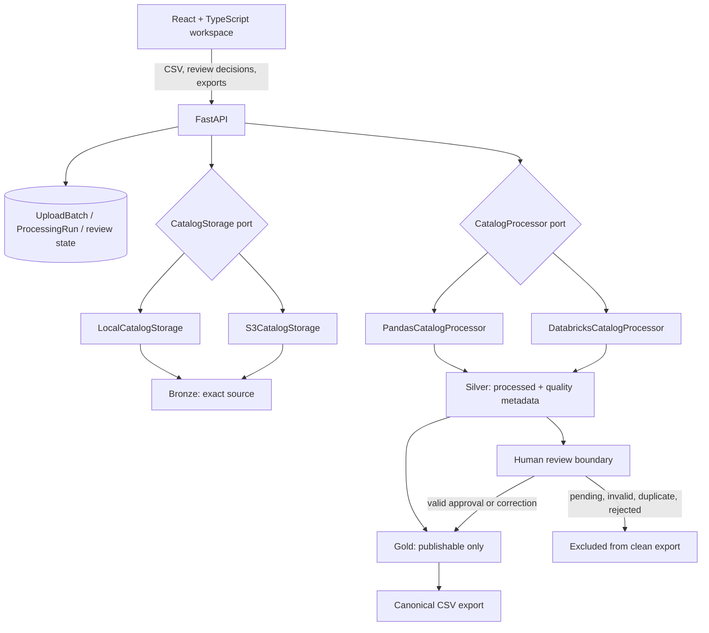
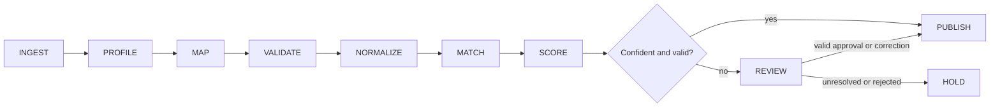
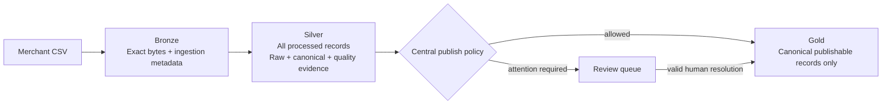

# Architecture

## System

FastAPI owns orchestration and relational workflow state. Storage and processor interfaces select local or cloud implementations explicitly. Local execution is synchronous. Databricks submission is asynchronous and is reconciled through the processing-run refresh endpoint.

## Pipeline

The current implementation maps before row normalization, then validates normalized canonical values. The diagram describes the logical evidence flow: validation and normalization traces jointly influence scoring and routing.

## Medallion model

## Invariants

- Raw bytes and row-level source values are preserved.
- Processed/Silver records include every automation outcome.
- Gold and the clean CSV use the same centralized publish policy.
- Pending Needs Review, Duplicate, Invalid, and Rejected records are excluded.
- Human approval can resolve ambiguity but cannot waive invalid canonical data.
- Automation confidence is immutable across human review.
- Default dashboard, review, record, and export queries are scoped to the latest batch.
- An explicit unknown batch ID returns `404` and never falls through to historical data.

## Local contract

`LocalCatalogStorage` writes deterministic per-batch paths under `.catalogflow-data`. `PandasCatalogProcessor` executes synchronously and persists JSONL Silver/Gold artifacts. SQLite is the default application-state database. No AWS or Databricks credentials are read or required.

## Production contract

`S3CatalogStorage` writes private, server-side-encrypted objects with deterministic keys and SHA-256 metadata. `DatabricksCatalogProcessor` submits the configured job and records its external run ID; submission and refresh failures remain failures and never invoke Pandas locally.

The Databricks task preserves Bronze bytes, invokes the shared deterministic Pandas kernel, and writes Delta layers. This is a correctness-first cloud execution boundary, not a claim of distributed Spark transformation. PostgreSQL is intended for relational application state while S3/Delta holds bulk artifacts.
